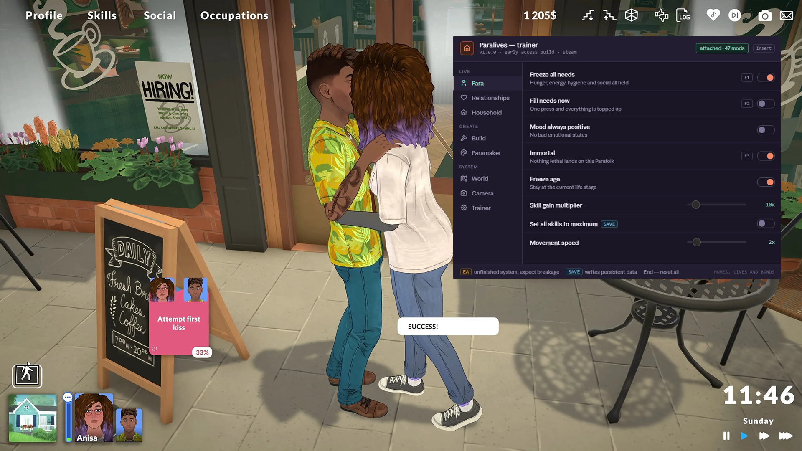

# Paralives Trainer — Mod Menu & Cheats for PC (v1.0.0)

**Paralives trainer** with an in-game **mod menu** for the life sim everyone's been waiting seven years for: infinite money, freeze all needs, free build mode, unlock all furniture and Paramaker items, immortal Parafolks, extended camera. Think of it as the cheat console Paralives doesn't ship with. Works with the **Steam** Early Access build from Paralives Studio. Open the overlay with `Insert`, flip a toggle, get back to your household.

> **[⬇ Download the latest Paralives trainer](https://github.com/pondseapurify/Paralives-Trainer/releases/latest)**

    

---

## Contents

- [What this is](#what-this-is)
- [Use the Workshop first](#use-the-workshop-first)
- [Early Access and broken offsets](#early-access-and-broken-offsets)
- [EA and save tags](#ea-and-save-tags)
- [Compatibility](#compatibility)
- [Features](#features)
  - [Para](#para--needs-and-skills) · [Relationships](#relationships) · [Household](#household--money-and-career) · [Build](#build--building-cheats) · [Paramaker](#paramaker--character-creator) · [World](#world--town-and-time) · [Camera](#camera--photo-mode-options) · [Trainer](#trainer-options)
- [Hotkeys](#hotkeys)
- [Installation](#installation)
- [How to use the mod menu](#how-to-use-the-mod-menu)
- [Troubleshooting](#troubleshooting)
- [FAQ](#faq)
- [Changelog](#changelog)
- [Disclaimer](#disclaimer)

---

## What this is

*Paralives* is a life simulation game about building homes, lives and bonds — Parafolks with layered clothing and adjustable height, a grid-free builder with curved walls and split-level floors, an open-world town of shops and parks and museums. Seven years of Patreon-funded development, no paid DLC ever, and about two more years planned in Early Access.

What it doesn't have is a cheat console. Life sim players have expected one since `rosebud` in 2000, and the absence is felt: there's no way to top up a household's funds, unlock the catalogue, or free-place an object outside the rules the builder enforces.

That's the gap. This trainer is essentially that console, wearing a UI.

---

## Use the Workshop first

Paralives supports mods natively, through an in-game interface and the Steam Workshop. That matters for what this trainer should and shouldn't be used for.

**If a Workshop mod does what you want, use the mod.** Mods survive patches better, load with the game, don't need a separate process running as administrator, and are what the developers actually designed the game around. Custom furniture, new traits, gameplay tweaks, UI improvements — all of that belongs in the Workshop.

**This trainer is for runtime toggles a mod handles badly.** Freezing needs mid-session, teleporting a Para, extending the camera past its limits, flipping free-build on for one room and off again, adding funds on a keypress. Things you switch on for two minutes and switch off.

The two coexist fine. **Workshop mod safe mode** in the Trainer tab detaches the trainer while the game reloads its mod list, which avoids a known conflict where Workshop mods stop appearing after a patch or a subscription change.

---

## Early Access and broken offsets

Paralives entered Early Access on 25 May 2026 and the studio expects roughly two years there. That means frequent patches, and every patch can move the memory addresses this trainer writes to.

- Each release lists the game build it was verified against. Check that first.
- Options fail independently — infinite money can keep working while free build goes dead.
- **Read-only mode** in the Trainer tab shows live values without writing anything, so you can tell whether the trainer still reads the game correctly.
- **Rolling save backup** is on by default. Early Access life sims eat saves.

Weather, seasons, pets and vehicles are on the roadmap but aren't in the game yet. When they land, they'll get their own options — there's nothing to hook until then, and any trainer claiming to have them now is lying to you.

---

## EA and save tags

Two tags appear next to option names in the menu.

**`EA`** — this option is tied to a system the game hasn't finished. Careers, social interactions, NPC routines and population density are all partially implemented, so these break more often than the rest and behave inconsistently between builds. Not a warning about cheating, just about stability.

**`save`** — this option writes persistent data: unlocked catalogue items, Paramaker content, skills, lots, household limits. Let the rolling backup run before you touch them.

Everything untagged is runtime-only and leaves nothing behind.

---

## Compatibility

| | |
|---|---|
| **Game** | Paralives (Paralives Studio, Steam Early Access since 25 May 2026) |
| **Store** | Steam |
| **Game version** | Early Access builds — see [release notes](https://github.com/pondseapurify/Paralives-Trainer/releases) for verified versions |
| **OS** | Windows 10 and Windows 11, 64-bit |
| **Runtime** | .NET Desktop Runtime 8 or newer |
| **Steam Workshop** | Compatible — see [Use the Workshop first](#use-the-workshop-first) |
| **Steam Deck / Proton** | Not supported |
| **Consoles** | No console release |

---

## Features

    

60+ options across eight tabs, grouped into **Live**, **Create** and **System**. Sliders show the shipped default.

### Para — needs and skills

| Option | What it does | Hotkey | Tag |
|---|---|---|---|
| **Freeze all needs** | Hunger, energy, hygiene and social all held | `F1` | — |
| **Fill needs now** | One press and everything is topped up | `F2` | — |
| **Mood always positive** | No bad emotional states | — | — |
| **Immortal** | Nothing lethal lands on this Parafolk | `F3` | — |
| **Freeze age** | Stay at the current life stage | — | — |
| **Skill gain multiplier** | `1x`–`100x`, default `10x` | — | — |
| **Set all skills to maximum** | — | — | save |
| **Movement speed** | `1x`–`10x`, default `2x` | — | — |

**Freeze all needs** and **Fill needs now** do different jobs and it's worth knowing which you want. Freeze holds everything where it is, so a Para with a half-empty energy bar stays half-empty forever. Fill tops everything to full once and lets it decay normally. Builders tend to want the first; storytellers tend to want the second.

### Relationships

| Option | What it does | Hotkey | Tag |
|---|---|---|---|
| **Instant friendship** | Every interaction lands perfectly | `F4` | — |
| **Relationship gain multiplier** | `1x`–`50x`, default `5x` | — | — |
| **No rejected interactions** | Nobody turns you down | — | — |
| **Freeze relationship decay** | Bonds don't fade while you're away | — | — |
| **Set relationship level** | `0%`–`100%`, default `100%` | — | — |
| **Unlock all social interactions** | — | — | EA |
| **Visitors never leave** | They stay until you dismiss them | — | — |

**Freeze relationship decay** is the quiet useful one. If you play several households in rotation, decay punishes you for the households you aren't currently in — which is a design problem, not a difficulty setting.

### Household — money and career

| Option | What it does | Hotkey | Tag |
|---|---|---|---|
| **Infinite money** | Household funds never drop | `F5` | — |
| **Add funds** | `1k`–`500k` written on press, default `50k` | — | — |
| **No bills** | Utilities never come due | — | — |
| **Instant promotion** | — | `F6` | — |
| **Salary multiplier** | `1x`–`50x`, default `5x` | — | — |
| **Career performance always maximum** | — | — | EA |
| **Unlock all careers** | — | — | EA |
| **Household size limit** | `1`–`16`, default `8` | — | save |

**Add funds** is deliberately a one-shot rather than a toggle. It's the `motherlode` equivalent — press it, get a fixed amount, keep playing with an economy that still functions. **Infinite money** removes the economy entirely, which some people want and most don't.

### Build — building cheats

| Option | What it does | Hotkey | Tag |
|---|---|---|---|
| **Free build mode** | Place anything anywhere, ignore the rules | `F7` | — |
| **Everything free** | Catalogue prices set to zero | `F12` | — |
| **Unlock all furniture and decor** | The full catalogue immediately | — | save |
| **Ignore lot boundaries** | Build past the property line | — | — |
| **Floor limit** | `1`–`16`, default `8` | — | — |
| **Object resize range** | `1x`–`20x`, past the slider the game gives you | — | — |
| **Disable collision** | Objects overlap freely | — | — |
| **Unlock all walls and floors** | — | — | save |

This is the tab most people are here for. Paralives' builder is the best-reviewed thing in the game, and these options extend it rather than skip it. **Object resize range** past the built-in limit and **Disable collision** together are how the elaborate builds you see posted actually get made.

**Floor limit** goes to 16 against the game's own 8. Expect the camera and pathfinding to complain above 10.

### Paramaker — character creator

| Option | What it does | Tag |
|---|---|---|
| **Unlock all clothing and makeup** | Every layer, every item | save |
| **Height range** | `50%`–`250%`, past the creator's own limits | — |
| **Unlock all traits** | — | save |
| **Trait slots** | `3`–`12`, default `5` | — |
| **Unlock all hair and colours** | — | save |
| **Edit any Parafolk** | Open the Paramaker for townies too | — |
| **Free Paramaker changes** | No cost to edit an existing Para | — |

**Edit any Parafolk** is the one that changes how the town feels. Being able to restyle the generated townies means your neighbourhood stops looking like it was assembled by a random number generator.

### World — town and time

| Option | What it does | Hotkey | Tag |
|---|---|---|---|
| **Freeze the clock** | The day stops where it stands | `F8` | — |
| **Time of day** | Any hour, default `14:00` | — | — |
| **Game speed** | `0.1x`–`10x`, default `1.0x` | — | — |
| **Teleport selected Para** | Jump to the cursor | `F9` | — |
| **Reveal the full town** | — | — | — |
| **Unlock all lots** | Own everything, buy nothing | — | save |
| **NPC routines always active** | — | — | EA |
| **Population density** | `1`–`10`, default `5` | — | EA |

Reviewers noted the Early Access town feels empty — NPCs have basic routines and there isn't much for them to do yet. **Population density** helps a little, but it can't invent activities that haven't been built. Set expectations accordingly.

### Camera & photo mode options

| Option | What it does | Hotkey | Tag |
|---|---|---|---|
| **Field of view** | `40`–`120 deg`, default `60 deg` | — | — |
| **Free camera** | Detach from the town view | `F10` | — |
| **Hide interface** | Drop the HUD and all prompts | `F11` | — |
| **Camera zoom range** | `1x`–`20x`, closer than the game allows | — | — |
| **First-person view** | Walk the town from a Para's eyes | — | EA |
| **Disable depth of field** | — | — | — |
| **Extended photo mode** | Filters, angles, timescale | — | — |

**Camera zoom range** plus **Hide interface** is how you photograph an interior properly. The default camera won't go close enough for detail shots of a room you've spent three hours decorating.

### Trainer options

| Option | What it does |
|---|---|
| **Rolling save backup** | Extra slots on an interval you set — **on by default** |
| **Backup interval** | `1`–`60 min`, default `10 min` |
| **Read-only mode** | Show values, write nothing — use after a patch |
| **Workshop mod safe mode** | Detach while mods reload — **on by default** |
| **Hotkeys** | Global bindings on or off |
| **Menu key** | Rebind the overlay — `Insert`, `F1`, `Home`, `~` |
| **Overlay opacity** | `40%`–`100%`, default `92%` |
| **Auto-load profile** | Apply the saved set on launch |

---

## Hotkeys

| Key | Action |
|---|---|
| `Insert` | Open or close the mod menu |
| `F1` | Freeze all needs |
| `F2` | Fill needs now |
| `F3` | Immortal |
| `F4` | Instant friendship |
| `F5` | Infinite money |
| `F6` | Instant promotion |
| `F7` | Free build mode |
| `F8` | Freeze the clock |
| `F9` | Teleport selected Para |
| `F10` | Free camera |
| `F11` | Hide interface |
| `F12` | Everything free |
| `End` | Reset every option |
| `↑ ↓ ← → Enter` | Navigate the menu without a mouse |

---

## Installation

1. **Download** the latest archive from the [Releases page](https://github.com/pondseapurify/Paralives-Trainer/releases/latest).
2. **Unblock it** — right-click the `.zip`, choose Properties, tick *Unblock*, then Apply. Windows quarantines downloaded archives and the trainer won't attach otherwise.
3. **Extract** anywhere outside `Program Files`.
4. **Launch the game first** and load a household, so the process exists.
5. **Run the trainer as administrator.** The header should read `attached` with your mod count.
6. **Press `Insert`.**

Save data typically sits under `%USERPROFILE%\AppData\LocalLow` in the studio's folder — check your install for the exact path, since it can differ between builds. Turn off Steam Cloud while you experiment so a bad local write doesn't sync upward.

---

## How to use the mod menu

Pick a tab on the left, flip what you need on the right. Sliders update live.

A few setups worth knowing:

- **Builder mode:** `Free build mode` + `Everything free` + `Disable collision` + `Object resize range 20x` + `Freeze the clock`. Nothing decays, nothing costs, nothing snaps. This is the setup most of the elaborate builds get made in.
- **Storyteller mode:** `Freeze relationship decay` + `Fill needs now` on a keypress + `Edit any Parafolk`. The sim keeps running, you just stop babysitting bladder bars.
- **The classic:** `Add funds 50k` and nothing else. One press, an economy that still works.
- **Interior photography:** `Camera zoom range 20x` + `Hide interface` + `Disable depth of field` + `Time of day 14:00`.
- **Safety only:** `Rolling save backup` + `Read-only mode`. The trainer writes nothing and just protects your saves through Early Access patches.

---

## Troubleshooting

**Options stopped working after a game update.** This is the Early Access tax. Check the Releases page for a build matching your game version, and use read-only mode to confirm the trainer still reads correctly.

**My Workshop mods stopped showing up.** This is a known game-side issue after patches and subscription changes, and it happens without any trainer running. Unsubscribe and resubscribe, verify the game files, and keep **Workshop mod safe mode** enabled so the trainer isn't attached while the mod list rebuilds.

**Trainer says the process wasn't found.** The game has to be running with a household loaded. Launch Paralives, load a save, then start the trainer.

**Nothing happens when I press Insert.** Another overlay is eating the key. Steam's overlay, Discord and RTSS are the usual suspects. Rebind under **Trainer → Menu key**.

**Build options do nothing.** They bind when you enter build mode. Enter it, then toggle.

**Para-specific options do nothing.** Most of the Para and Relationships tab writes to the currently selected Parafolk. Select one first.

**The game softlocked.** Paralives has had softlock bugs in Early Access, including one involving Parafolks holding a baby. Not everything is the trainer's fault — check the game's patch notes before filing an issue.

**Windows Defender flagged it.** Trainers read and write another process's memory, which is what a lot of malware also does, so heuristic scanners flag them on principle. Add an exclusion if you're comfortable with that — and if you'd rather not, don't. That's a reasonable call.

---

## FAQ

### Does Paralives have cheat codes like The Sims?

No built-in cheat console as of the current Early Access build — no `motherlode`, no `rosebud`, no `bb.moveobjects`. This trainer fills that gap: **Add funds** is the money cheat, **Free build mode** and **Disable collision** are the build cheats.

### How do I get money in Paralives?

**Add funds** in the Household tab writes a set amount on a keypress, up to 500k. **Infinite money** holds the funds permanently, and **No bills** stops utilities coming due.

### How do I unlock all furniture in Paralives?

**Unlock all furniture and decor** in the Build tab, plus **Unlock all walls and floors**. **Everything free** sets catalogue prices to zero if you'd rather keep the unlock progression but not pay for it.

### Will I get banned for using cheats in Paralives?

It's a single-player game with no anti-cheat and no multiplayer, so there's nothing to be banned from.

### Does it work with Steam Workshop mods?

Yes. Keep **Workshop mod safe mode** on so the trainer detaches while the mod list reloads. If a Workshop mod already does what you want, use the mod — it'll survive patches better.

### Does it work with the latest Early Access patch?

Check the Releases page for verified builds. Paralives patches often and offsets move; expect a short gap after each game update.

### Are there options for weather, seasons, pets or cars?

Not yet, because those features aren't in the game yet. They're on the studio's roadmap and they'll get options when they ship.

### Can I make my Parafolk taller than the creator allows?

Yes — **Height range** in the Paramaker tab goes from 50% to 250% past the built-in slider limits.

### Does it work on Steam Deck or Linux?

No. Windows only. Proton changes how the game's memory is laid out.

### How do I turn everything off?

Press `End`.

---

## Changelog

### v1.0.0 — 11 August 2026

First public release. 60+ options across Para, Relationships, Household, Build, Paramaker, World, Camera and Trainer. Rolling save backup and Workshop mod safe mode on by default. `EA` tagging on options tied to systems the game hasn't finished.

Full history on the [Releases page](https://github.com/pondseapurify/Paralives-Trainer/releases).

---

## Disclaimer

Unofficial fan tool. **Not affiliated with, endorsed by, or connected to Paralives Studio or Valve.** *Paralives* and all related names and assets belong to their respective owners.

Paralives Studio funded seven years of development through Patreon and committed to never charging for DLC. If you get a lot of use out of this trainer, the game itself is the thing worth supporting.

Intended for single-player use on your own copy. Modifying a running game's memory carries real risk of crashes and save corruption, and more so in an Early Access build that changes often — let the rolling backup run, and use it at your own risk.

Released under the [MIT License](LICENSE).

---

Paralives trainer · Paralives cheats · Paralives mod menu for PC · infinite money, add funds, freeze needs, free build mode, unlock all furniture, immortal Parafolks, extended camera · Steam Early Access · Paralives Studio · life simulation game and Sims alternative
